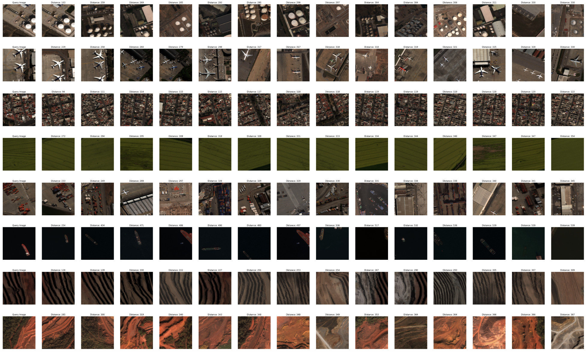

# Earth Search

A library for efficient indexing & similarity search of satellite images. 

Earth Search is built on top of Faiss (Facebook AI Similarity Search) with a number of feature extractors for indexing and querying satellite image embeddings. 

<p align="center">
  
</p>

Task List
- [ ] Update README with installation, usage, etc.
- [ ] Everything else...
- [ ] Extract location from query image filenames, export to geospatial file formats
- [ ] Integrate other feature extraction methods
- [ ] 

## Installation:


## Usage:

Package import usage:
```python
from package.main import test_function
test_function()

```

CLI usage:
`earthsearch {chip,index,search} ...`

```
usage: earthsearch chip [-h] --image_dir IMAGE_DIR --chip_dir CHIP_DIR
                        [--window_size WINDOW_SIZE] [--stride STRIDE]
                        [--valid_exts [VALID_EXTS ...]] [--multiprocess]

options:
  -h, --help            show this help message and exit
  --image_dir IMAGE_DIR
                        Directory path to images
  --chip_dir CHIP_DIR   Directory path to write chips to
  --window_size WINDOW_SIZE
                        Size of sliding window, e.g., 512
  --stride STRIDE       Amount of overlap in x, y direction, e.g., 0.2
  --valid_exts [VALID_EXTS ...]
                        Image extensions to filter for
  --multiprocess        Use multiprocessing vs multithreading
```

```
usage: earthsearch index [-h] --image_dir IMAGE_DIR --index_path INDEX_PATH
                         --indexed_images_path INDEXED_IMAGES_PATH --index_type INDEX_TYPE
                         --model_type MODEL_TYPE [--device DEVICE] [--batch_size BATCH_SIZE]
                         [--overwrite_index]

options:
  -h, --help            show this help message and exit
  --image_dir IMAGE_DIR
                        Path to directory of images to index
  --index_path INDEX_PATH
                        Path to save index
  --indexed_images_path INDEXED_IMAGES_PATH
                        Path to save file containing indexed image paths
  --index_type INDEX_TYPE
                        Type of index to use (currently only using L2)
  --model_type MODEL_TYPE
                        Type of model to use
  --device DEVICE       Device to use for feature extraction (cuda, mps, cpu)
  --batch_size BATCH_SIZE
                        Number of images per batch
  --overwrite_index     Overwrite existing index of same index_path
(.venv)  ✝  ~/repos/earthsearch   main 
```

```
usage: earthsearch search [-h] --query_image QUERY_IMAGE --index_path INDEX_PATH
                          --indexed_images_path INDEXED_IMAGES_PATH --index_type INDEX_TYPE
                          --top_k TOP_K --model_type MODEL_TYPE [--device DEVICE]

options:
  -h, --help            show this help message and exit
  --query_image QUERY_IMAGE
                        Path to directory of images to index
  --index_path INDEX_PATH
                        Path to saved index
  --indexed_images_path INDEXED_IMAGES_PATH
                        Path to file containing indexed image paths
  --index_type INDEX_TYPE
                        Type of index to use (currently only using L2)
  --top_k TOP_K         top k-Nearest Neighbors to return
  --model_type MODEL_TYPE
                        Type of model to use
  --device DEVICE       Device to use for feature extraction (cuda, mps, cpu)
```